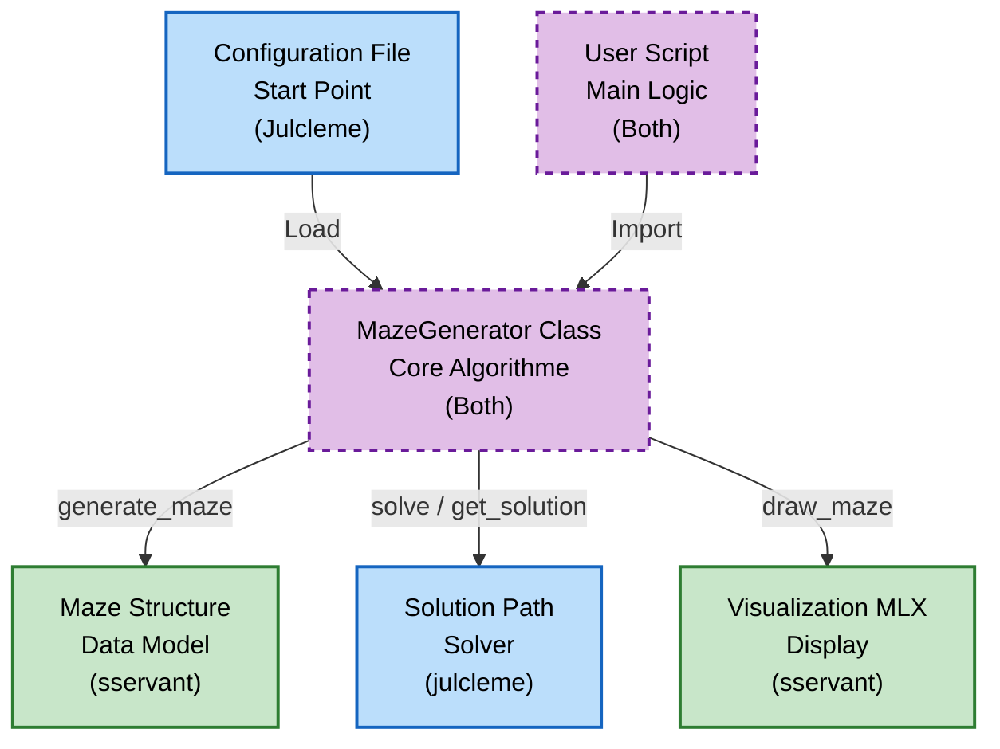
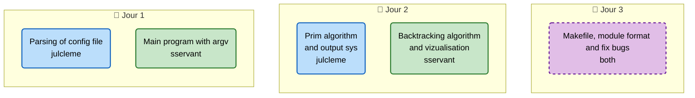

# A-Maze-ing

*This project has been created as part
of the 42 curriculum by sservant and julcleme*

# Description
This project is a python project focused on understanding and implementing maze generation and maze solving algorithms by using a graphic library. 



# Algorithms
This project implements the following algorithms:

1.  **Recursive Backtracking**: The choice of a backtracking algorithm was very quick because it is the most efficient in generating mazes and creates a perfect maze for sure. ```sservant```
2.  **Prim Algorithm**: We chose the Prim algorithm because using graphs is good practice in this style of generation, and it's a good thing to see. ```julcleme```


#### Custom Parameters & Data Access
*   **Instantiation**: `MazeGenerator(config_path)`
*   **Access Maze**: `generator.maze` [Verify attribute name]
*   **Access Solution**: `generator.solution` [Verify attribute name]

# Configuration File
The configuration file controls the maze generation. Below is the complete structure:

```bash
# this is a comment

# width of the maze
WIDTH=53
# height of the maze
HEIGHT=53

# position of the entry point of the maze (x, y)
ENTRY=1,1
# position of the exit point of the maze (x, y)
EXIT=49,49

# path of the output file
OUTPUT_FILE=output.txt

# the generated maze contains only one solution
PERFECT=0

# 0 for Eller's (or Prim's), 1 for Backtracking

# view generation and resolving in realtime
ANIMATION=1
```

# Resources
This is the list of the resources used to make this project. 
- [wikipedia.org](https://en.wikipedia.org/wiki/Maze-solving_algorithm) used for the maze solving algorithms
- [wikipedia.org](https://en.wikipedia.org/wiki/Maze_generation_algorithm) used to understand the maze generation techniques
- [emrezorlu.com](https://emrezorlu.com/2012/03/20/maze-creation-solving/) used to understand the differences between the different algorithms
- [professor-l.github.io](https://professor-l.github.io/mazes/) used to visualise concepts behind used algorithms
- [chatgpt.com](https://chatgpt.com) was used to explain us basics of each algorithm. It also helped with colors and the minilib-x library
- [mypy.readthedocs.io](https://mypy.readthedocs.io/en/stable/) documentation for the mypy norm

# Developer Guide

## Package Installation

The maze generator is available as a pip-installable package. You can build it from source:

```bash
make build
```

Then install it:

```bash
pip install mazegen-1.0.0-py3-none-any.whl
```

## Usage Example

```python
from mazegen import MazeGenerator

# Initialize from config file, size and seed are optionnal
generator = MazeGenerator("config.txt", seed=42, size=(53, 53))

# Generate maze
maze = generator.generate_maze()

# Display (if graphical mode enabled)
generator.draw_maze(maze)

# Solve
solution_path = generator.get_solution(maze)

# Run event loop (keeps window open)
generator.run()


# All functions in generator class are reusable for any all programs like a pac-man ;) to get list[list[int]] of the maze or other features
```

## Team

- sservant
- julcleme

Roles:
- sservant: Algorithm implementation (Backtracking, Analysis)
- julcleme: Graphics (MLX), Packaging, Refactoring, Eller's algorithm enhancements

Planning:
We started by researching algorithms, implemented a basic console version, then added MLX graphics. Finally, we refactored repeatedly to meet the modularity requirements and packaging standards.

## Advanced Features
- **Multiple Algorithms**: Configurable via `PERFECT` flag (0 for prim, 1 for Backtracking).
- **Graphical Interface**: Interactive buttons for solving/resetting.
- **Continuous Walls**: Post-processing for Eller's algorithm to avoid isolated dots.
- **Graphics window**: You can display the maze with mlx
- **42 symbol**: 42 symbol is display in center of the maze

## Planning


## TODO
- [x] Fix eller animation
- [x] You must implement the maze generation as a unique class
- [x] Use frameworks like pytest or unittest for unit tests, covering edge cases.
- [x] Your functions should handle exceptions gracefully to avoid crashes
- [x] Use PEP 257 for docstrings
- [x] Use type definition and check using `mypy`
- [x] Makefile using rules `install` `run` `debug` `clean` `lint-strict` and `lint`
- [x] Add a `.gitignore`
- [x] Create test programs to verify project functionality
- [x] Use venv
- [x] Fix `makefile`: add install `mlx`
- [x] A default configuration file must be available in your Git repository
- [x] The maze must be randomly generated, but reproducibility via a seed is required
- [x] You must provide a short documentation describing how to:
	- [x] Instantiate and use your generator, with at least a basic example.
	- [x] Pass custom parameters (e.g., `size`, `seed`).
	- [x] Access the generated structure, and access at least a solution.
- [x] Fix `README.md`
	- [x] The complete structure and format of your config file.
	- [x] The maze generation algorithm you chose.
	- [x] Why you chose this algorithm.
	- [x] What part of your code is reusable, and how.
	- [x] Your team and project management with:
		- [x] The roles of each team member.
		- [x] Your anticipated planning and how it evolved until the end
		- [x] What worked well and what could be improved
		- [x] Have you used any specific tools? Which ones?
	- [x] If you implement advanced features (multiple algorithms, display options)describe them in this README.md file
- [x] NO FRENCH :fr:


- [x] This entire reusable module (code and documentation) must be available in a single file
	suitable for a later installation by pip.
	This package must be called mazegen-* and the file must be located at the root of your
	git repository.
	Both .tar.gz and .whl extensions are allowed, as generated by the standard build of a
	Python package.
	Example of a full filename: mazegen-1.0.0-py3-none-any.whl .
	You must provide in you Git repository all needed elements to build the package. This
	will be asked during the evaluation: in a virtualenv or equivalent, install the needed tools
	and build your package again from your sources.
	The main README.md file (not part of the reusable module) must also contain this short
	documentation.