# A-Maze-ing

Maze generation and solving visualisation

## Authors

- [@sservant](https://github.com/sservant)
- [@julcleme](https://github.com/julcleme)

## Description

This project is a Python project focused on understanding and implementing maze generation and maze solving algorithms using a graphic library (MLX). It has been created as part of the 42 curriculum to explore algorithmic complexity and visualization.


## Build

The maze generator is available as a pip-installable package. You can build it from source using the provided Makefile.

```bash
make build
```

Then install it:

```bash
make install
```

## Usage

### Python Script

```python
from mazegen import MazeGenerator

# Initialize from config file, size and seed are optionnal
generator = MazeGenerator("config.txt", seed="42", size=(53, 53))

# Generate maze
maze = generator.generate_maze()

# Display (if graphical mode enabled)
generator.draw_maze(maze)

# Solve
solution_path = generator.get_solution(maze)

# Run event loop (keeps window open)
generator.run()
```

### Configuration File

The configuration file controls the maze generation physics and rules.

```bash
# width and height of the maze
WIDTH=50
HEIGHT=50

# position of entry/exit points (x, y)
ENTRY=1,14
EXIT=50,14

# path of the output file
OUTPUT_FILE=output.txt

# the generated maze contains only one solution (True/False)
PERFECT=False

# view generation and resolving in realtime
ANIMATION=0
DELAY=0

# maze seed, 0 is a random one
SEED=0
```

## Algorithms

- **Stacking algorithm** (by `sservant`): The most efficient choice for generating perfect mazes quickly.
- **Prim Algorithm** (by `julcleme`): A graph-based generation algorithm chosen for good practice and visual aesthetic.

### Advanced Features
- **Graphical Interface**: Interactive buttons for solving/resetting via MLX.
- **Continuous Walls**: Post-processing for Prim's algorithm to avoid isolated dots.
- **Parametric Generation**: Configurable via `PERFECT` flag (False for Prim, True for Stacking).

## Contributions

- `julcleme` — Packaging, Prim's algorithm enhancements, Parsing, Makefile.
- `sservant` — Graphics (MLX), Stacking Algorithm advanced performance, Ranking/Array utilities.

### Planning

```mermaid
graph TD
    classDef jul fill:#BBDEFB,stroke:#1565C0,stroke-width:2px,color:black;
    classDef sse fill:#C8E6C9,stroke:#2E7D32,stroke-width:2px,color:black;
    classDef both fill:#E1BEE7,stroke:#6A1B9A,stroke-width:2px,stroke-dasharray: 5 5,color:black;

    subgraph J3 [📅 Jour 3]
        direction TB
        T6("Makefile, module format and fix bugs</br>both"):::both
    end

    subgraph J2 [📅 Jour 2]
        direction TB
        T1("Prim algorithm</br>and output sys</br>julcleme"):::jul
        T2("Stacking algorithm</br>and vizualisation</br>sservant"):::sse
    end

    subgraph J1 [📅 Jour 1]
        direction TB
        T4("Parsing of config file</br>julcleme"):::jul
        T5("Main program with argv</br>sservant"):::sse

    end
```



## Resources

- [wikipedia.org](https://en.wikipedia.org/wiki/Maze-solving_algorithm) — maze solving algorithms
- [wikipedia.org](https://en.wikipedia.org/wiki/Maze_generation_algorithm) — maze generation techniques
- [emrezorlu.com](https://emrezorlu.com/2012/03/20/maze-creation-solving/) — differences between algorithms
- [professor-l.github.io](https://professor-l.github.io/mazes/) — visualization of concepts
- [chatgpt.com](https://chatgpt.com) — basics of algorithms, colors and minilib-x library
- [mypy.readthedocs.io](https://mypy.readthedocs.io/en/stable/) — documentation for the mypy norm

## Disclaimer

⚠️ IMPORTANT — Educational use only:
- Do not copy this code for assessed work in 42 or other courses.
- Use this repository for study and reference only.

## Feedback

If you have feedback, open an issue or contact the author.